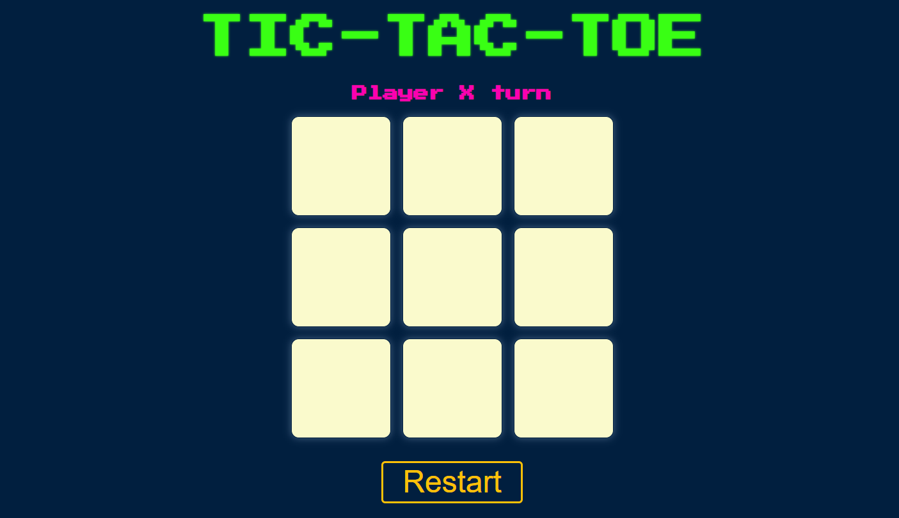
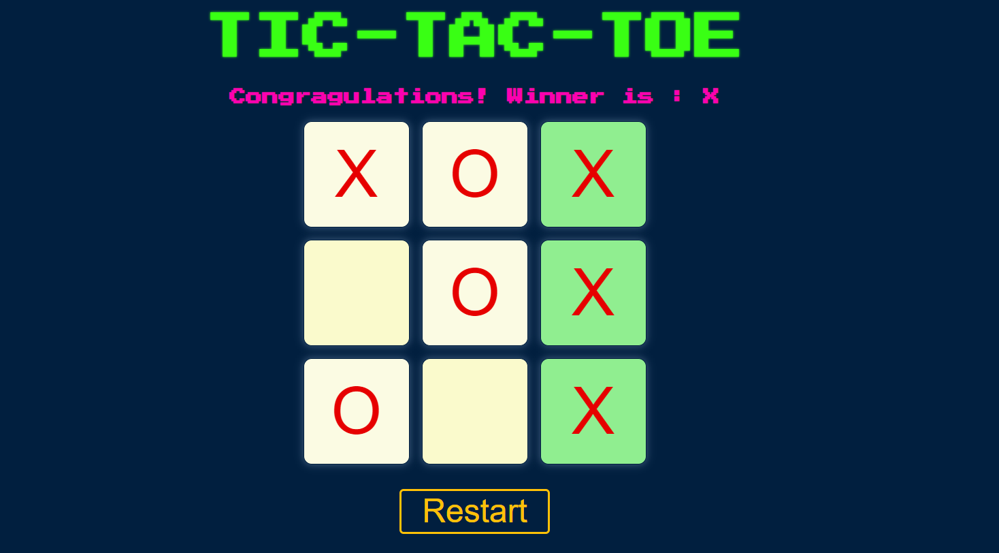
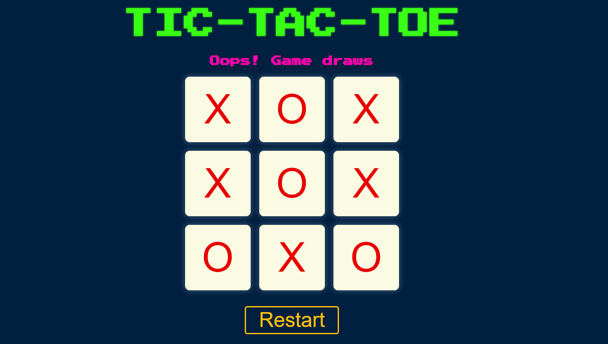

# 🎮 [Tic-Tac-Toe Game](https://yashwanth-al.github.io/Tic-Tac-Toe/)
Click the link above to play the game directly on your browser!

 

Tic-Tac-Toe is a classic two-player game built using **HTML**, **CSS**, and **JavaScript**. The goal is to be the first player to get three of your marks in a row (horizontally, vertically, or diagonally).

---

## How to Play 🕹️

1. **Choose a Square**: Players take turns clicking on empty squares on the grid.
2. **Make Your Move**: Player X goes first, followed by Player O.
3. **Win the Game**: The first player to align three of their marks (X or O) in a row wins.
4. **Restart the Game**: Click the "Restart" button to reset the game and start a new round.

---

 

## Features 🌟

- **Simple Interface**: Easy-to-use and intuitive design.
- **Player Turn Indication**: Visual and audio feedback indicating the current player's turn.
- **Winner Highlighting**: The winning line is highlighted when a player wins.
- **Draw Condition**: If all squares are filled without a winner, the game ends in a draw.
- **Restart Option**: Easily restart the game without refreshing the page.

---

 

## Technologies Used 💻

- **HTML**: Provides the structure for the game layout.
- **CSS**: Adds styling and layout design, making the game visually appealing.
- **JavaScript (jQuery)**: Implements the game logic and interactive features.

---

Feel free to [clone the repository](https://github.com/Yashwanth-AL/Tic-Tac-Toe.git) and try it out!
